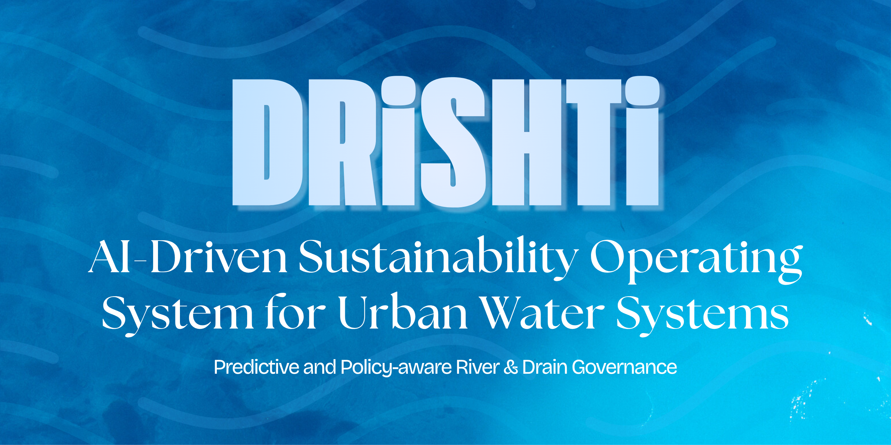

  

<h1 align="center">DRISHTI</h1>

Delhi contributes a majority of the Yamuna’s pollution despite covering only a small stretch of the river.  
Current interventions are reactive, fragmented, and lack continuous monitoring.

**DRISHTI** is a lightweight, real-time decision support platform that helps authorities detect pollution early, predict risks, and take targeted action.

Instead of waiting for damage, we enable a **monitor → predict → intervene** strategy.

---

## 🚨 Problem

- Untreated sewage enters through multiple drains
- Monitoring is sparse and manual
- Illegal/ intermittent dumping goes unnoticed
- STPs are overloaded or bypassed
- Agencies lack coordinated, real-time data

Result:  
By the time pollution is noticed, it’s already too late.

---

## 💡 Our Solution

We built a **smart environmental monitoring system** that:

- Continuously collects sensor data
- Detects anomalies automatically
- Simulates pollution risk
- Tracks issues
- Visualizes everything on one dashboard

It acts as the **control center for river health**.

---

## 🧠 System Flow

Sensors → Database → AI/ML → Backend API → Dashboard → Action

- Sensors send water quality data
- ML detects abnormal spikes
- Alerts are generated automatically
- Officials raise issues and take action
- Policies can be simulated before deployment

---

## ✨ Features

### 📊 Real-Time Monitoring
- Live sensor readings
- Time-series charts
- Water quality metrics (pH, DO, BOD, COD, turbidity, ammonia, temperature, conductivity)

### 🚨 Intelligent Alerts
- Automatic anomaly detection
- Severity-based warnings
- Location-specific flags

### 🔮 Prediction / Simulation Engine
- Short-term pollution forecasting
- Risk scoring for drains/segments

### 📝 Issue Tracker
- Raise issues
- Track resolution status

### 🗺 Interactive Dashboard
- Sensor map
- Alerts table
- Charts & analytics
- Authentication
